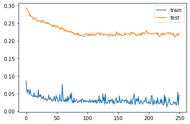
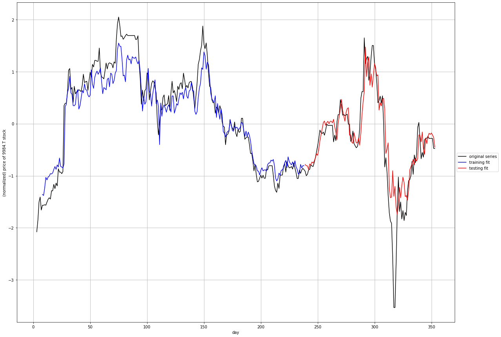
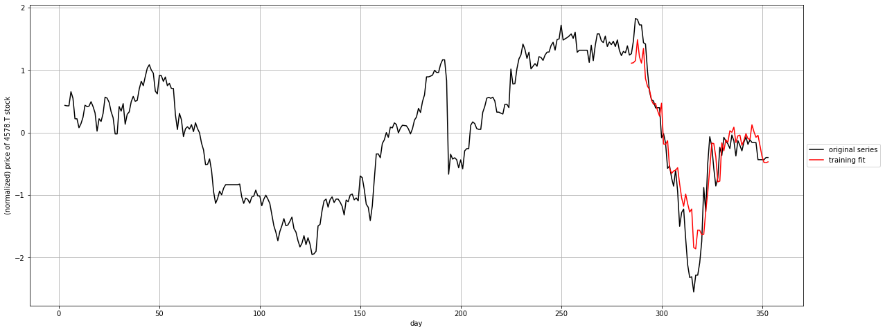

# Using LSTM to predict the Tokyo Stock Exchange variations

One of the first exercise we are proposed to do with Long Short Term Memory models is to try to predict the stock exchange variations.

When we look at the graphs, it's quite impressive to see the Training and Test line hug the real price so close, but how good are these predictions?

Hypothesis:
* We only try to predict the next day, because more than that, the model just have no clue where things are going, and the accumulation of unknown just makes it even less reliable. So day traiding only
* Because values are normalized in order to train the model, the prediction will also be normalized, which means that it will not give a price. We could try to convert the value back to a real value, but is it really necessary? If the objective is just to guess which stock will go up, and how confident we are that it will go up, just a general indication (up/down) could be sufficient.

With these hypothesis, I tried to train a model that would look at the past value, and try to guess which stock should be purchased tomorrow morning, because it should be going up during the day.

## Conclusion
at the end

## Spoilers
I wouldn't use this to chose my investments

## Importing libraries


```python
import matplotlib.pyplot as plt
# import seaborn
import json
from datetime import date
import datetime
# import random
import time
from os import path
import pandas as pd
import numpy as np
from scipy.stats import beta
from math import sqrt

import requests

# from pandas_datareader import data as dr

from html.parser import HTMLParser
from html.entities import name2codepoint

# pip install opencv-python matplotlib numpy scipy keras scikit-learn tensorflow

from sklearn import preprocessing
from sklearn.metrics import mean_squared_error

from keras.models import Sequential
from keras.layers import Dense
from keras.layers import LSTM
import keras

np.random.seed(42)

# pip install yfinance
import yfinance as yf

%matplotlib inline

# %load_ext autoreload
# %autoreload 2

```

# Load/Update of the list of symbols from Nikkei 225 site

This next cell checks if there is a nikkei225.json file in the current folder and loads it. If there isn't one, it will go recover the latest list on the official nikkei site. (# Nikkei 225: https://indexes.nikkei.co.jp/en/nkave/index/component?idx=nk225)


```python
nfile = 'nikkei225.json'

class MyHTMLParser(HTMLParser):    
    def handle_starttag(self, tag, attrs):
        global dept, nikkei225, area, company, location
        
        dept += 1
        for attr in attrs:
            if attr[0] == 'class':
                if attr[1] == 'col-xs-11 col-sm-11' and dept == 8:
                    location = 0
                    company = {
                        'code': "",
                        'url': "",
                        'name': "",
                        'area': ""
                    }
                elif attr[1] == 'col-xs-3 col-sm-1_5' and dept == 8:
                    location = 1
            elif attr[0] == 'href' and location == 2:
                company['url'] = attr[1]
                location = 3

    def handle_endtag(self, tag):
        global dept
        dept -= 1

    def handle_data(self, data):
        global dept, nikkei225, area, company, location
        if location == 0 and dept == 8:
            print("Area:", data)
            company["area"] = data
            location = None
        elif location == 1 and dept == 8 and data not in ['Code', 'Company Name']:
            company['code'] = data + ".T"
            location = 2
        elif location == 3 and dept == 8:
            company['name'] = data
            nikkei225[company['code']] = dict(company)                

            
if path.exists(nfile):
    if (time.time() - path.getmtime(nfile) < (7 * 24 * 60 * 60)): # Update the list every week
        print('the current {} file is good enough'.format(nfile))
        with open(nfile, 'r') as infile:
            nikkei225 = json.load(infile)
    else:
        print('the current {} file is too old'.format(nfile))
        nikkei225 = {}
        
if len(nikkei225.keys()) == 0:
    nikkei225 = {}
    company = {}
    area = ""
    dept = 0
    location = None
    
    r = requests.get('https://indexes.nikkei.co.jp/en/nkave/index/component?idx=nk225')
    print('http get status', r.status_code, 'length', len(r.text))
    parser = MyHTMLParser()
    parser.feed(r.text)
    
    with open(nfile, 'w') as outfile:
        json.dump(nikkei225, outfile)

print('Number of symbols in the Nikkei 225 index: {}'.format(len(nikkei225.keys())))
```

    the current nikkei225.json file is good enough
    Number of symbols in the Nikkei 225 index: 225


# Download the current symbol values from the Yahoo Finance Site


```python
today = datetime.date.today()
tomorrow = today + datetime.timedelta(days=1)
print('today', today.strftime("%Y-%m-%d"), 'tomorrow', tomorrow.strftime("%Y-%m-%d"))

tickers = list(nikkei225.keys())
start_date = '2019-01-01'
end_date = tomorrow
```

    today 2020-05-07 tomorrow 2020-05-08


```python
# Downloading the values from Yahoo Finance here
df_raw_nikkei225 = yf.download(tickers, start=start_date, end=end_date)

# Plot all the closing prices. this is a mess, but good to confirm that we have the data
# df_raw_nikkei225['Close'].plot(figsize=(16, 9))
```

    [*********************100%***********************]  225 of 225 completed


```python
# A bit of cleanup...
all_weekdays = pd.date_range(start=start_date, end=end_date, freq='B')
df_clean_nikkei2225 = df_raw_nikkei225.reindex(all_weekdays)
df_clean_nikkei2225 = df_clean_nikkei2225.fillna(method='ffill')
df_clean_nikkei2225.tail()
```


<div>
<style scoped>
    .dataframe tbody tr th:only-of-type {
        vertical-align: middle;
    }

    .dataframe tbody tr th {
        vertical-align: top;
    }

    .dataframe thead tr th {
        text-align: left;
    }
</style>
<table border="1" class="dataframe">
  <thead>
    <tr>
      <th></th>
      <th colspan="10" halign="left">Adj Close</th>
      <th>...</th>
      <th colspan="10" halign="left">Volume</th>
    </tr>
    <tr>
      <th></th>
      <th>1332.T</th>
      <th>1333.T</th>
      <th>1605.T</th>
      <th>1721.T</th>
      <th>1801.T</th>
      <th>1802.T</th>
      <th>1803.T</th>
      <th>1808.T</th>
      <th>1812.T</th>
      <th>1925.T</th>
      <th>...</th>
      <th>9502.T</th>
      <th>9503.T</th>
      <th>9531.T</th>
      <th>9532.T</th>
      <th>9602.T</th>
      <th>9613.T</th>
      <th>9735.T</th>
      <th>9766.T</th>
      <th>9983.T</th>
      <th>9984.T</th>
    </tr>
  </thead>
  <tbody>
    <tr>
      <th>2020-05-04</th>
      <td>461.0</td>
      <td>2215.0</td>
      <td>673.5</td>
      <td>2969.0</td>
      <td>3245.0</td>
      <td>913.0</td>
      <td>818.0</td>
      <td>1150.0</td>
      <td>1075.0</td>
      <td>2665.0</td>
      <td>...</td>
      <td>1892700.0</td>
      <td>3692700.0</td>
      <td>1940300.0</td>
      <td>1039700.0</td>
      <td>337600.0</td>
      <td>5975000.0</td>
      <td>639400.0</td>
      <td>784000.0</td>
      <td>1540400.0</td>
      <td>21139600.0</td>
    </tr>
    <tr>
      <th>2020-05-05</th>
      <td>461.0</td>
      <td>2215.0</td>
      <td>673.5</td>
      <td>2969.0</td>
      <td>3245.0</td>
      <td>913.0</td>
      <td>818.0</td>
      <td>1150.0</td>
      <td>1075.0</td>
      <td>2665.0</td>
      <td>...</td>
      <td>1892700.0</td>
      <td>3692700.0</td>
      <td>1940300.0</td>
      <td>1039700.0</td>
      <td>337600.0</td>
      <td>5975000.0</td>
      <td>639400.0</td>
      <td>784000.0</td>
      <td>1540400.0</td>
      <td>21139600.0</td>
    </tr>
    <tr>
      <th>2020-05-06</th>
      <td>461.0</td>
      <td>2215.0</td>
      <td>673.5</td>
      <td>2969.0</td>
      <td>3245.0</td>
      <td>913.0</td>
      <td>818.0</td>
      <td>1150.0</td>
      <td>1075.0</td>
      <td>2665.0</td>
      <td>...</td>
      <td>1892700.0</td>
      <td>3692700.0</td>
      <td>1940300.0</td>
      <td>1039700.0</td>
      <td>337600.0</td>
      <td>5975000.0</td>
      <td>639400.0</td>
      <td>784000.0</td>
      <td>1540400.0</td>
      <td>21139600.0</td>
    </tr>
    <tr>
      <th>2020-05-07</th>
      <td>458.0</td>
      <td>2212.0</td>
      <td>677.0</td>
      <td>3010.0</td>
      <td>3360.0</td>
      <td>934.0</td>
      <td>848.0</td>
      <td>1142.0</td>
      <td>1112.0</td>
      <td>2650.5</td>
      <td>...</td>
      <td>2878600.0</td>
      <td>3342100.0</td>
      <td>1656100.0</td>
      <td>1305400.0</td>
      <td>399900.0</td>
      <td>3506700.0</td>
      <td>466200.0</td>
      <td>814700.0</td>
      <td>750500.0</td>
      <td>15944000.0</td>
    </tr>
    <tr>
      <th>2020-05-08</th>
      <td>458.0</td>
      <td>2212.0</td>
      <td>677.0</td>
      <td>3010.0</td>
      <td>3360.0</td>
      <td>934.0</td>
      <td>848.0</td>
      <td>1142.0</td>
      <td>1112.0</td>
      <td>2650.5</td>
      <td>...</td>
      <td>2878600.0</td>
      <td>3342100.0</td>
      <td>1656100.0</td>
      <td>1305400.0</td>
      <td>399900.0</td>
      <td>3506700.0</td>
      <td>466200.0</td>
      <td>814700.0</td>
      <td>750500.0</td>
      <td>15944000.0</td>
    </tr>
  </tbody>
</table>
<p>5 rows × 1350 columns</p>
</div>


```python
# keeping a dataframe with just the close values
df_close_nikkei225 = df_clean_nikkei2225['Close']

# keeping a dataframe with the relevant values used for our model
df_relev_nikkei225 = df_clean_nikkei2225[['Close', 'High', 'Low', 'Volume']]
df_relev_nikkei225.tail()
```


<div>
<style scoped>
    .dataframe tbody tr th:only-of-type {
        vertical-align: middle;
    }

    .dataframe tbody tr th {
        vertical-align: top;
    }

    .dataframe thead tr th {
        text-align: left;
    }
</style>
<table border="1" class="dataframe">
  <thead>
    <tr>
      <th></th>
      <th colspan="10" halign="left">Close</th>
      <th>...</th>
      <th colspan="10" halign="left">Volume</th>
    </tr>
    <tr>
      <th></th>
      <th>1332.T</th>
      <th>1333.T</th>
      <th>1605.T</th>
      <th>1721.T</th>
      <th>1801.T</th>
      <th>1802.T</th>
      <th>1803.T</th>
      <th>1808.T</th>
      <th>1812.T</th>
      <th>1925.T</th>
      <th>...</th>
      <th>9502.T</th>
      <th>9503.T</th>
      <th>9531.T</th>
      <th>9532.T</th>
      <th>9602.T</th>
      <th>9613.T</th>
      <th>9735.T</th>
      <th>9766.T</th>
      <th>9983.T</th>
      <th>9984.T</th>
    </tr>
  </thead>
  <tbody>
    <tr>
      <th>2020-05-04</th>
      <td>461.0</td>
      <td>2215.0</td>
      <td>673.5</td>
      <td>2969.0</td>
      <td>3245.0</td>
      <td>913.0</td>
      <td>818.0</td>
      <td>1150.0</td>
      <td>1075.0</td>
      <td>2665.0</td>
      <td>...</td>
      <td>1892700.0</td>
      <td>3692700.0</td>
      <td>1940300.0</td>
      <td>1039700.0</td>
      <td>337600.0</td>
      <td>5975000.0</td>
      <td>639400.0</td>
      <td>784000.0</td>
      <td>1540400.0</td>
      <td>21139600.0</td>
    </tr>
    <tr>
      <th>2020-05-05</th>
      <td>461.0</td>
      <td>2215.0</td>
      <td>673.5</td>
      <td>2969.0</td>
      <td>3245.0</td>
      <td>913.0</td>
      <td>818.0</td>
      <td>1150.0</td>
      <td>1075.0</td>
      <td>2665.0</td>
      <td>...</td>
      <td>1892700.0</td>
      <td>3692700.0</td>
      <td>1940300.0</td>
      <td>1039700.0</td>
      <td>337600.0</td>
      <td>5975000.0</td>
      <td>639400.0</td>
      <td>784000.0</td>
      <td>1540400.0</td>
      <td>21139600.0</td>
    </tr>
    <tr>
      <th>2020-05-06</th>
      <td>461.0</td>
      <td>2215.0</td>
      <td>673.5</td>
      <td>2969.0</td>
      <td>3245.0</td>
      <td>913.0</td>
      <td>818.0</td>
      <td>1150.0</td>
      <td>1075.0</td>
      <td>2665.0</td>
      <td>...</td>
      <td>1892700.0</td>
      <td>3692700.0</td>
      <td>1940300.0</td>
      <td>1039700.0</td>
      <td>337600.0</td>
      <td>5975000.0</td>
      <td>639400.0</td>
      <td>784000.0</td>
      <td>1540400.0</td>
      <td>21139600.0</td>
    </tr>
    <tr>
      <th>2020-05-07</th>
      <td>458.0</td>
      <td>2212.0</td>
      <td>677.0</td>
      <td>3010.0</td>
      <td>3360.0</td>
      <td>934.0</td>
      <td>848.0</td>
      <td>1142.0</td>
      <td>1112.0</td>
      <td>2650.5</td>
      <td>...</td>
      <td>2878600.0</td>
      <td>3342100.0</td>
      <td>1656100.0</td>
      <td>1305400.0</td>
      <td>399900.0</td>
      <td>3506700.0</td>
      <td>466200.0</td>
      <td>814700.0</td>
      <td>750500.0</td>
      <td>15944000.0</td>
    </tr>
    <tr>
      <th>2020-05-08</th>
      <td>458.0</td>
      <td>2212.0</td>
      <td>677.0</td>
      <td>3010.0</td>
      <td>3360.0</td>
      <td>934.0</td>
      <td>848.0</td>
      <td>1142.0</td>
      <td>1112.0</td>
      <td>2650.5</td>
      <td>...</td>
      <td>2878600.0</td>
      <td>3342100.0</td>
      <td>1656100.0</td>
      <td>1305400.0</td>
      <td>399900.0</td>
      <td>3506700.0</td>
      <td>466200.0</td>
      <td>814700.0</td>
      <td>750500.0</td>
      <td>15944000.0</td>
    </tr>
  </tbody>
</table>
<p>5 rows × 900 columns</p>
</div>


## Graphing a single symbol with rolling averages (5, 20, 50 days)


```python
## Tests on a single symbol: the first one

for symbol in list(df_close_nikkei225.keys())[:1]:
    print(symbol)
    # Get the MSFT timeseries. This now returns a Pandas Series object indexed by date.
    
    wtv = df_close_nikkei225.loc[:, symbol]
    # msft = close.loc[:]

    # Calculate the 20 and 100 days moving averages of the closing prices
    roll_5_days = wtv.rolling(window=5).mean()
    roll_20_days = wtv.rolling(window=20).mean()
    roll_50_days = wtv.rolling(window=50).mean()
    roll_100_days = wtv.rolling(window=100).mean()

    # Plot everything by leveraging the very powerful matplotlib package
    fig, ax = plt.subplots(figsize=(16,9))

    ax.plot(wtv.index, wtv, label=symbol)
    ax.plot(roll_5_days.index, roll_5_days, label='5 days rolling')
    ax.plot(roll_20_days.index, roll_20_days, label='20 days rolling')
    ax.plot(roll_50_days.index, roll_50_days, label='50 days rolling')
    # ax.plot(roll_100_days.index, roll_100_days, label='100 days rolling')

    ax.set_xlabel('Date')
    ax.set_ylabel('Adjusted closing price (¥)')
    ax.legend()
```

    1332.T


## Defining the model

The next cell defines the function that will return a LSTN RNN.


```python
# LSTM Related functions

def build_part1_RNN(window_size, n_features = 1, nodes = 5):
    model = Sequential()
    model.add(LSTM(nodes, activation='tanh', input_shape=(window_size, n_features), dropout=0.2))
    model.add(Dense(1))
    
    # build model using keras documentation recommended optimizer initialization
    optimizer = keras.optimizers.RMSprop(lr=0.001, rho=0.9, epsilon=1e-08, decay=0.0)

    # compile the model
    model.compile(loss='mean_squared_error', optimizer=optimizer)
    # model.compile(loss='mae', optimizer='adam')
        
    return model
```

## Preparing the data to train the model

The `window_transform_3d_series` function returns the series days (X) and the value that need to be predicted (y)


```python
# convert series to supervised learning
def window_transform_3D_series(df, window_size, out=['Close']):
    # containers for input/output pairs
    X = []
    y = []
    
    for ii in range(len(df) - window_size):
        X.append(list(df.iloc[ii:ii+window_size].values))
        y.append(df.iloc[ii+window_size][out].values)

    # reshape each
    X = np.asarray(X)
    X.shape = (np.shape(X)[0:3])
    y = np.asarray(y)
    y.shape = (len(y),1)
    

    return X, y

def mean_beta(a, b):
    mean, var, skew, kurt = beta.stats(a, b, moments='mvsk')
    return mean

if False: #testing function, just to confirm that the values are properly returned by window_transform_3D_series
    window_size = 8
#     features = ['Close', 'Low', 'High', 'Volume']
    features = ['Close']
    n_features = len(features)

    for symbol in list(df_close_nikkei225.keys())[:1]:
        print(symbol)
        df = df_relev_nikkei225.loc[:, [(x, symbol) for x in features]]

        df_scaled=(df-df.mean())/df.std()

        X,y = window_transform_3D_series(df_scaled.fillna(0).head(20),window_size, 'Close')
        print([{"X": list(X[i][-1]),"y": y[i][0]} for i in range(len(y))])
```

## Initializing the model


```python
# window the data using your windowing function
window_size = 8
features = ['Close', 'Low', 'High', 'Volume']
# features = ['Close']
n_features = len(features)

error_objective = 0.02

epochs = 250
batch_size = 50
nodes = window_size * 3

model = build_part1_RNN(window_size, n_features, nodes)
```


```python
%%time

# for symbol in list(df_close_nikkei225.keys())[:1]:
for symbol in sorted([x for x in nikkei225.keys()]):# if nikkei225[x]['area'] == 'Pharmaceuticals']:
    df = df_relev_nikkei225.loc[:, [(x, symbol) for x in features]]
    
    df_scaled=(df-df.mean())/df.std()
    
    X,y = window_transform_3D_series(df_scaled.fillna(0), window_size, 'Close')
    
    train_test_split = int(np.ceil(2*len(y)/float(3)))   # set the split point
    
    X_train = X[:train_test_split,:]
    y_train = y[:train_test_split]
    
    # keep the last chunk for testing
    X_test = X[train_test_split:,:]
    y_test = y[train_test_split:]
    
    # NOTE: to use keras's RNN LSTM module our input must be reshaped to [samples, window size, stepsize] 
    X_train = np.asarray(np.reshape(X_train, (X_train.shape[0], window_size, n_features)))
    X_test = np.asarray(np.reshape(X_test, (X_test.shape[0], window_size, n_features)))
    
    history = model.fit(X_train, y_train, epochs=epochs, batch_size=batch_size, validation_data=(X_test, y_test), verbose=0, shuffle=False)
    
    # generate predictions for training
    train_predict = model.predict(X_train)
    test_predict = model.predict(X_test)
    
    # print out training and testing errors
    training_error = model.evaluate(X_train, y_train, verbose=0)
    testing_error = model.evaluate(X_test, y_test, verbose=0)
    print('* {} {} training error = {:0.3f} ({}), testing error: {:0.3f} ({})'.format(
        symbol, nikkei225[symbol]['name'], 
        training_error, training_error < error_objective, 
        testing_error, testing_error < error_objective
    ))
    
# plot history
plt.plot(history.history['loss'], label='train')
plt.plot(history.history['val_loss'], label='test')
plt.legend()
plt.show()
```

    * 1332.T NIPPON SUISAN KAISHA, LTD. training error = 0.049 (False), testing error: 0.949 (False)
    * 1333.T MARUHA NICHIRO CORP. training error = 0.037 (False), testing error: 0.353 (False)
    * 1605.T INPEX CORP. training error = 0.021 (False), testing error: 1.204 (False)
    * 1721.T COMSYS HOLDINGS CORP. training error = 0.042 (False), testing error: 0.282 (False)
    * 1801.T TAISEI CORP. training error = 0.039 (False), testing error: 0.130 (False)
    * 1802.T OBAYASHI CORP. training error = 0.023 (False), testing error: 0.201 (False)
    * 1803.T SHIMIZU CORP. training error = 0.023 (False), testing error: 0.432 (False)
    * 1808.T HASEKO CORP. training error = 0.043 (False), testing error: 0.142 (False)
    * 1812.T KAJIMA CORP. training error = 0.034 (False), testing error: 0.191 (False)
    * 1925.T DAIWA HOUSE IND. CO., LTD. training error = 0.027 (False), testing error: 0.547 (False)
    * 1928.T SEKISUI HOUSE, LTD. training error = 0.026 (False), testing error: 0.047 (False)
    * 1963.T JGC HOLDINGS CORP. training error = 0.021 (False), testing error: 0.370 (False)
    * 2002.T NISSHIN SEIFUN GROUP INC. training error = 0.043 (False), testing error: 0.277 (False)
    * 2269.T MEIJI HOLDINGS CO., LTD. training error = 0.057 (False), testing error: 0.155 (False)
    * 2282.T NH FOODS LTD. training error = 0.030 (False), testing error: 0.369 (False)
    * 2413.T M3, INC. training error = 0.028 (False), testing error: 0.128 (False)
    * 2432.T DENA CO., LTD. training error = 0.033 (False), testing error: 0.135 (False)
    * 2501.T SAPPORO HOLDINGS LTD. training error = 0.023 (False), testing error: 0.505 (False)
    * 2502.T ASAHI GROUP HOLDINGS, LTD. training error = 0.024 (False), testing error: 0.767 (False)
    * 2503.T KIRIN HOLDINGS CO., LTD. training error = 0.062 (False), testing error: 0.170 (False)
    * 2531.T TAKARA HOLDINGS INC. training error = 0.037 (False), testing error: 0.147 (False)
    * 2768.T SOJITZ CORP. training error = 0.030 (False), testing error: 0.184 (False)
    * 2801.T KIKKOMAN CORP. training error = 0.049 (False), testing error: 0.306 (False)
    * 2802.T AJINOMOTO CO., INC. training error = 0.079 (False), testing error: 0.207 (False)
    * 2871.T NICHIREI CORP. training error = 0.073 (False), testing error: 0.164 (False)
    * 2914.T JAPAN TOBACCO INC. training error = 0.030 (False), testing error: 0.106 (False)
    * 3086.T J.FRONT RETAILING CO., LTD. training error = 0.013 (True), testing error: 0.459 (False)
    * 3099.T ISETAN MITSUKOSHI HOLDINGS LTD. training error = 0.033 (False), testing error: 0.141 (False)
    * 3101.T TOYOBO CO., LTD. training error = 0.037 (False), testing error: 0.210 (False)
    * 3103.T UNITIKA, LTD. training error = 0.061 (False), testing error: 0.142 (False)
    * 3105.T NISSHINBO HOLDINGS INC. training error = 0.029 (False), testing error: 0.213 (False)
    * 3289.T TOKYU FUDOSAN HOLDINGS CORP. training error = 0.014 (True), testing error: 0.295 (False)
    * 3382.T SEVEN & I HOLDINGS CO., LTD. training error = 0.044 (False), testing error: 0.127 (False)
    * 3401.T TEIJIN LTD. training error = 0.035 (False), testing error: 0.252 (False)
    * 3402.T TORAY INDUSTRIES, INC. training error = 0.014 (True), testing error: 0.551 (False)
    * 3405.T KURARAY CO., LTD. training error = 0.039 (False), testing error: 0.133 (False)
    * 3407.T ASAHI KASEI CORP. training error = 0.020 (False), testing error: 0.280 (False)
    * 3436.T SUMCO CORP. training error = 0.037 (False), testing error: 0.141 (False)
    * 3861.T OJI HOLDINGS CORP. training error = 0.067 (False), testing error: 0.107 (False)
    * 3863.T NIPPON PAPER INDUSTRIES CO., LTD. training error = 0.033 (False), testing error: 0.163 (False)
    * 4004.T SHOWA DENKO K.K. training error = 0.046 (False), testing error: 0.150 (False)
    * 4005.T SUMITOMO CHEMICAL CO., LTD. training error = 0.023 (False), testing error: 0.388 (False)
    * 4021.T NISSAN CHEMICAL CORP. training error = 0.037 (False), testing error: 0.178 (False)
    * 4042.T TOSOH CORP. training error = 0.042 (False), testing error: 0.121 (False)
    * 4043.T TOKUYAMA CORP. training error = 0.043 (False), testing error: 0.199 (False)
    * 4061.T DENKA CO., LTD. training error = 0.040 (False), testing error: 0.509 (False)
    * 4063.T SHIN-ETSU CHEMICAL CO., LTD. training error = 0.045 (False), testing error: 0.156 (False)
    * 4151.T KYOWA KIRIN CO., LTD. training error = 0.035 (False), testing error: 0.215 (False)
    * 4183.T MITSUI CHEMICALS, INC. training error = 0.039 (False), testing error: 0.218 (False)
    * 4188.T MITSUBISHI CHEMICAL HOLDINGS CORP. training error = 0.050 (False), testing error: 0.425 (False)
    * 4208.T UBE INDUSTRIES, LTD. training error = 0.040 (False), testing error: 0.301 (False)
    * 4272.T NIPPON KAYAKU CO., LTD. training error = 0.028 (False), testing error: 0.560 (False)
    * 4324.T DENTSU GROUP INC. training error = 0.041 (False), testing error: 0.367 (False)
    * 4452.T KAO CORP. training error = 0.069 (False), testing error: 0.278 (False)
    * 4502.T TAKEDA PHARMACEUTICAL CO., LTD. training error = 0.045 (False), testing error: 0.114 (False)
    * 4503.T ASTELLAS PHARMA INC. training error = 0.036 (False), testing error: 0.111 (False)
    * 4506.T SUMITOMO DAINIPPON PHARMA CO., LTD. training error = 0.031 (False), testing error: 0.060 (False)
    * 4507.T SHIONOGI & CO., LTD. training error = 0.034 (False), testing error: 0.375 (False)
    * 4519.T CHUGAI PHARMACEUTICAL CO., LTD. training error = 0.021 (False), testing error: 0.277 (False)
    * 4523.T EISAI CO., LTD. training error = 0.053 (False), testing error: 0.061 (False)
    * 4543.T TERUMO CORP. training error = 0.039 (False), testing error: 0.179 (False)
    * 4568.T DAIICHI SANKYO CO., LTD. training error = 0.046 (False), testing error: 0.091 (False)
    * 4578.T OTSUKA HOLDINGS CO., LTD. training error = 0.043 (False), testing error: 0.145 (False)
    * 4631.T DIC CORP. training error = 0.042 (False), testing error: 0.203 (False)
    * 4689.T Z HOLDINGS CORP. training error = 0.029 (False), testing error: 0.193 (False)
    * 4704.T TREND MICRO INC. training error = 0.055 (False), testing error: 0.189 (False)
    * 4751.T CYBERAGENT, INC. training error = 0.097 (False), testing error: 0.483 (False)
    * 4755.T RAKUTEN, INC. training error = 0.057 (False), testing error: 0.100 (False)
    * 4901.T FUJIFILM HOLDINGS CORP. training error = 0.064 (False), testing error: 0.253 (False)
    * 4902.T KONICA MINOLTA, INC. training error = 0.040 (False), testing error: 0.020 (False)
    * 4911.T SHISEIDO CO., LTD. training error = 0.052 (False), testing error: 0.207 (False)
    * 5019.T IDEMITSU KOSAN CO., LTD. training error = 0.058 (False), testing error: 0.104 (False)
    * 5020.T JXTG HOLDINGS, INC. training error = 0.042 (False), testing error: 0.193 (False)
    * 5101.T THE YOKOHAMA RUBBER CO., LTD. training error = 0.018 (True), testing error: 0.105 (False)
    * 5108.T BRIDGESTONE CORP. training error = 0.024 (False), testing error: 0.117 (False)
    * 5201.T AGC INC. training error = 0.032 (False), testing error: 0.123 (False)
    * 5202.T NIPPON SHEET GLASS CO., LTD. training error = 0.032 (False), testing error: 0.091 (False)
    * 5214.T NIPPON ELECTRIC GLASS CO., LTD. training error = 0.028 (False), testing error: 0.054 (False)
    * 5232.T SUMITOMO OSAKA CEMENT CO., LTD. training error = 0.019 (True), testing error: 0.406 (False)
    * 5233.T TAIHEIYO CEMENT CORP. training error = 0.032 (False), testing error: 0.265 (False)
    * 5301.T TOKAI CARBON CO., LTD. training error = 0.059 (False), testing error: 0.070 (False)
    * 5332.T TOTO LTD. training error = 0.026 (False), testing error: 0.209 (False)
    * 5333.T NGK INSULATORS, LTD. training error = 0.017 (True), testing error: 0.175 (False)
    * 5401.T NIPPON STEEL CORP. training error = 0.028 (False), testing error: 0.088 (False)
    * 5406.T KOBE STEEL, LTD. training error = 0.037 (False), testing error: 0.165 (False)
    * 5411.T JFE HOLDINGS, INC. training error = 0.036 (False), testing error: 0.047 (False)
    * 5541.T PACIFIC METALS CO., LTD. training error = 0.048 (False), testing error: 0.220 (False)
    * 5631.T THE JAPAN STEEL WORKS, LTD. training error = 0.019 (True), testing error: 0.277 (False)
    * 5703.T NIPPON LIGHT METAL HOLDINGS CO., LTD. training error = 0.044 (False), testing error: 0.114 (False)
    * 5706.T MITSUI MINING & SMELTING CO. training error = 0.040 (False), testing error: 0.218 (False)
    * 5707.T TOHO ZINC CO., LTD. training error = 0.038 (False), testing error: 0.077 (False)
    * 5711.T MITSUBISHI MATERIALS CORP. training error = 0.022 (False), testing error: 0.260 (False)
    * 5713.T SUMITOMO METAL MINING CO., LTD. training error = 0.029 (False), testing error: 0.466 (False)
    * 5714.T DOWA HOLDINGS CO., LTD. training error = 0.010 (True), testing error: 0.332 (False)
    * 5801.T FURUKAWA ELECTRIC CO., LTD. training error = 0.043 (False), testing error: 0.160 (False)
    * 5802.T SUMITOMO ELECTRIC IND., LTD. training error = 0.019 (True), testing error: 0.217 (False)
    * 5803.T FUJIKURA LTD. training error = 0.029 (False), testing error: 0.139 (False)
    * 5901.T TOYO SEIKAN GROUP HOLDINGS, LTD. training error = 0.046 (False), testing error: 0.204 (False)
    * 6098.T RECRUIT HOLDINGS CO., LTD. training error = 0.022 (False), testing error: 0.244 (False)
    * 6103.T OKUMA CORP. training error = 0.031 (False), testing error: 0.314 (False)
    * 6113.T AMADA CO., LTD. training error = 0.026 (False), testing error: 0.239 (False)
    * 6178.T JAPAN POST HOLDINGS CO., LTD. training error = 0.040 (False), testing error: 0.072 (False)
    * 6301.T KOMATSU LTD. training error = 0.039 (False), testing error: 0.095 (False)
    * 6302.T SUMITOMO HEAVY IND., LTD. training error = 0.034 (False), testing error: 0.082 (False)
    * 6305.T HITACHI CONST. MACH. CO., LTD. training error = 0.029 (False), testing error: 0.194 (False)
    * 6326.T KUBOTA CORP. training error = 0.031 (False), testing error: 0.125 (False)
    * 6361.T EBARA CORP. training error = 0.024 (False), testing error: 0.191 (False)
    * 6367.T DAIKIN INDUSTRIES, LTD. training error = 0.041 (False), testing error: 0.106 (False)
    * 6471.T NSK LTD. training error = 0.031 (False), testing error: 0.100 (False)
    * 6472.T NTN CORP. training error = 0.028 (False), testing error: 0.191 (False)
    * 6473.T JTEKT CORP. training error = 0.022 (False), testing error: 0.182 (False)
    * 6479.T MINEBEA MITSUMI INC. training error = 0.033 (False), testing error: 0.149 (False)
    * 6501.T HITACHI, LTD. training error = 0.023 (False), testing error: 0.417 (False)
    * 6503.T MITSUBISHI ELECTRIC CORP. training error = 0.040 (False), testing error: 0.170 (False)
    * 6504.T FUJI ELECTRIC CO., LTD. training error = 0.039 (False), testing error: 0.335 (False)
    * 6506.T YASKAWA ELECTRIC CORP. training error = 0.053 (False), testing error: 0.138 (False)
    * 6645.T OMRON CORP. training error = 0.042 (False), testing error: 0.065 (False)
    * 6674.T GS YUASA CORP. training error = 0.023 (False), testing error: 0.245 (False)
    * 6701.T NEC CORP. training error = 0.051 (False), testing error: 0.200 (False)
    * 6702.T FUJITSU LTD. training error = 0.029 (False), testing error: 0.409 (False)
    * 6703.T OKI ELECTRIC IND. CO., LTD. training error = 0.016 (True), testing error: 0.386 (False)
    * 6724.T SEIKO EPSON CORP. training error = 0.032 (False), testing error: 0.346 (False)
    * 6752.T PANASONIC CORP. training error = 0.032 (False), testing error: 0.304 (False)
    * 6758.T SONY CORP. training error = 0.039 (False), testing error: 0.185 (False)
    * 6762.T TDK CORP. training error = 0.036 (False), testing error: 0.170 (False)
    * 6770.T ALPS ALPINE CO., LTD. training error = 0.014 (True), testing error: 0.319 (False)
    * 6841.T YOKOGAWA ELECTRIC CORP. training error = 0.034 (False), testing error: 0.392 (False)
    * 6857.T ADVANTEST CORP. training error = 0.038 (False), testing error: 0.095 (False)
    * 6902.T DENSO CORP. training error = 0.025 (False), testing error: 0.335 (False)
    * 6952.T CASIO COMPUTER CO., LTD. training error = 0.030 (False), testing error: 0.072 (False)
    * 6954.T FANUC CORP. training error = 0.032 (False), testing error: 0.422 (False)
    * 6971.T KYOCERA CORP. training error = 0.032 (False), testing error: 0.140 (False)
    * 6976.T TAIYO YUDEN CO., LTD. training error = 0.034 (False), testing error: 0.190 (False)
    * 6988.T NITTO DENKO CORP. training error = 0.064 (False), testing error: 0.109 (False)
    * 7003.T MITSUI E&S HOLDINGS CO., LTD. training error = 0.060 (False), testing error: 0.252 (False)
    * 7004.T HITACHI ZOSEN CORP. training error = 0.058 (False), testing error: 0.134 (False)
    * 7011.T MITSUBISHI HEAVY IND., LTD. training error = 0.024 (False), testing error: 0.361 (False)
    * 7012.T KAWASAKI HEAVY IND., LTD. training error = 0.022 (False), testing error: 0.256 (False)
    * 7013.T IHI CORP. training error = 0.028 (False), testing error: 0.275 (False)
    * 7186.T CONCORDIA FINANCIAL GROUP, LTD. training error = 0.029 (False), testing error: 0.197 (False)
    * 7201.T NISSAN MOTOR CO., LTD. training error = 0.040 (False), testing error: 0.131 (False)
    * 7202.T ISUZU MOTORS LTD. training error = 0.035 (False), testing error: 0.193 (False)
    * 7203.T TOYOTA MOTOR CORP. training error = 0.036 (False), testing error: 0.117 (False)
    * 7205.T HINO MOTORS, LTD. training error = 0.019 (True), testing error: 0.300 (False)
    * 7211.T MITSUBISHI MOTORS CORP. training error = 0.039 (False), testing error: 0.146 (False)
    * 7261.T MAZDA MOTOR CORP. training error = 0.037 (False), testing error: 0.160 (False)
    * 7267.T HONDA MOTOR CO., LTD. training error = 0.048 (False), testing error: 0.187 (False)
    * 7269.T SUZUKI MOTOR CORP. training error = 0.025 (False), testing error: 0.257 (False)
    * 7270.T SUBARU CORP. training error = 0.030 (False), testing error: 0.298 (False)
    * 7272.T YAMAHA MOTOR CO., LTD. training error = 0.028 (False), testing error: 0.222 (False)
    * 7731.T NIKON CORP. training error = 0.038 (False), testing error: 0.141 (False)
    * 7733.T OLYMPUS CORP. training error = 0.028 (False), testing error: 0.154 (False)
    * 7735.T SCREEN HOLDINGS CO., LTD. training error = 0.041 (False), testing error: 0.080 (False)
    * 7751.T CANON INC. training error = 0.026 (False), testing error: 0.343 (False)
    * 7752.T RICOH CO., LTD. training error = 0.018 (True), testing error: 0.417 (False)
    * 7762.T CITIZEN WATCH CO., LTD. training error = 0.025 (False), testing error: 0.313 (False)
    * 7832.T BANDAI NAMCO HOLDINGS INC. training error = 0.070 (False), testing error: 0.066 (False)
    * 7911.T TOPPAN PRINTING CO., LTD. training error = 0.024 (False), testing error: 0.131 (False)
    * 7912.T DAI NIPPON PRINTING CO., LTD. training error = 0.028 (False), testing error: 0.116 (False)
    * 7951.T YAMAHA CORP. training error = 0.032 (False), testing error: 0.132 (False)
    * 8001.T ITOCHU CORP. training error = 0.028 (False), testing error: 0.125 (False)
    * 8002.T MARUBENI CORP. training error = 0.020 (True), testing error: 0.215 (False)
    * 8015.T TOYOTA TSUSHO CORP. training error = 0.017 (True), testing error: 0.289 (False)
    * 8028.T FAMILYMART CO., LTD. training error = 0.033 (False), testing error: 0.162 (False)
    * 8031.T MITSUI & CO., LTD. training error = 0.020 (True), testing error: 0.276 (False)
    * 8035.T TOKYO ELECTRON LTD. training error = 0.039 (False), testing error: 0.111 (False)
    * 8053.T SUMITOMO CORP. training error = 0.022 (False), testing error: 0.344 (False)
    * 8058.T MITSUBISHI CORP. training error = 0.044 (False), testing error: 0.239 (False)
    * 8233.T TAKASHIMAYA CO., LTD. training error = 0.034 (False), testing error: 0.133 (False)
    * 8252.T MARUI GROUP CO., LTD. training error = 0.023 (False), testing error: 0.198 (False)
    * 8253.T CREDIT SAISON CO., LTD. training error = 0.024 (False), testing error: 0.181 (False)
    * 8267.T AEON CO., LTD. training error = 0.067 (False), testing error: 0.155 (False)
    * 8303.T SHINSEI BANK, LTD. training error = 0.073 (False), testing error: 0.276 (False)
    * 8304.T AOZORA BANK, LTD. training error = 0.047 (False), testing error: 0.293 (False)
    * 8306.T MITSUBISHI UFJ FINANCIAL GROUP, INC. training error = 0.024 (False), testing error: 0.449 (False)
    * 8308.T RESONA HOLDINGS, INC. training error = 0.035 (False), testing error: 0.420 (False)
    * 8309.T SUMITOMO MITSUI TRUST HOLDINGS, INC. training error = 0.025 (False), testing error: 0.298 (False)
    * 8316.T SUMITOMO MITSUI FINANCIAL GROUP, INC. training error = 0.014 (True), testing error: 0.454 (False)
    * 8331.T THE CHIBA BANK, LTD. training error = 0.043 (False), testing error: 0.232 (False)
    * 8354.T FUKUOKA FINANCIAL GROUP, INC. training error = 0.055 (False), testing error: 0.237 (False)
    * 8355.T THE SHIZUOKA BANK, LTD. training error = 0.045 (False), testing error: 0.230 (False)
    * 8411.T MIZUHO FINANCIAL GROUP, INC. training error = 0.019 (True), testing error: 0.405 (False)
    * 8601.T DAIWA SECURITIES GROUP INC. training error = 0.041 (False), testing error: 0.131 (False)
    * 8604.T NOMURA HOLDINGS, INC. training error = 0.041 (False), testing error: 0.093 (False)
    * 8628.T MATSUI SECURITIES CO., LTD. training error = 0.033 (False), testing error: 0.099 (False)
    * 8630.T SOMPO HOLDINGS, INC. training error = 0.029 (False), testing error: 0.543 (False)
    * 8725.T MS&AD INSURANCE GROUP HOLDINGS, INC. training error = 0.025 (False), testing error: 0.378 (False)
    * 8729.T SONY FINANCIAL HOLDINGS INC. training error = 0.048 (False), testing error: 0.291 (False)
    * 8750.T DAI-ICHI LIFE HOLDINGS, INC. training error = 0.041 (False), testing error: 0.260 (False)
    * 8766.T TOKIO MARINE HOLDINGS, INC. training error = 0.027 (False), testing error: 0.367 (False)
    * 8795.T T&D HOLDINGS, INC. training error = 0.040 (False), testing error: 0.231 (False)
    * 8801.T MITSUI FUDOSAN CO., LTD. training error = 0.015 (True), testing error: 0.616 (False)
    * 8802.T MITSUBISHI ESTATE CO., LTD. training error = 0.031 (False), testing error: 0.554 (False)
    * 8804.T TOKYO TATEMONO CO., LTD. training error = 0.021 (False), testing error: 0.143 (False)
    * 8830.T SUMITOMO REALTY & DEVELOPMENT CO., LTD. training error = 0.024 (False), testing error: 0.501 (False)
    * 9001.T TOBU RAILWAY CO., LTD. training error = 0.042 (False), testing error: 0.092 (False)
    * 9005.T TOKYU CORP. training error = 0.037 (False), testing error: 0.446 (False)
    * 9007.T ODAKYU ELECTRIC RAILWAY CO., LTD. training error = 0.042 (False), testing error: 0.621 (False)
    * 9008.T KEIO CORP. training error = 0.053 (False), testing error: 0.383 (False)
    * 9009.T KEISEI ELECTRIC RAILWAY CO., LTD. training error = 0.039 (False), testing error: 0.287 (False)
    * 9020.T EAST JAPAN RAILWAY CO. training error = 0.034 (False), testing error: 0.752 (False)
    * 9021.T WEST JAPAN RAILWAY CO. training error = 0.022 (False), testing error: 0.311 (False)
    * 9022.T CENTRAL JAPAN RAILWAY CO., LTD. training error = 0.041 (False), testing error: 0.314 (False)
    * 9062.T NIPPON EXPRESS CO., LTD. training error = 0.054 (False), testing error: 0.162 (False)
    * 9064.T YAMATO HOLDINGS CO., LTD. training error = 0.128 (False), testing error: 0.030 (False)
    * 9101.T NIPPON YUSEN K.K. training error = 0.027 (False), testing error: 0.221 (False)
    * 9104.T MITSUI O.S.K.LINES, LTD. training error = 0.025 (False), testing error: 0.307 (False)
    * 9107.T KAWASAKI KISEN KAISHA, LTD. training error = 0.037 (False), testing error: 0.117 (False)
    * 9202.T ANA HOLDINGS INC. training error = 0.022 (False), testing error: 0.239 (False)
    * 9301.T MITSUBISHI LOGISTICS CORP. training error = 0.043 (False), testing error: 0.232 (False)
    * 9412.T SKY PERFECT JSAT HOLDINGS INC. training error = 0.054 (False), testing error: 0.247 (False)
    * 9432.T NIPPON TELEGRAPH & TELEPHONE CORP. training error = 0.053 (False), testing error: 0.149 (False)
    * 9433.T KDDI CORP. training error = 0.042 (False), testing error: 0.152 (False)
    * 9437.T NTT DOCOMO, INC. training error = 0.043 (False), testing error: 0.183 (False)
    * 9501.T TOKYO ELECTRIC POWER COMPANY HOLDINGS, I training error = 0.050 (False), testing error: 0.076 (False)
    * 9502.T CHUBU ELECTRIC POWER CO., INC. training error = 0.072 (False), testing error: 0.162 (False)
    * 9503.T THE KANSAI ELECTRIC POWER CO., INC. training error = 0.058 (False), testing error: 0.067 (False)
    * 9531.T TOKYO GAS CO., LTD. training error = 0.056 (False), testing error: 0.272 (False)
    * 9532.T 
             training error = 0.066 (False), testing error: 0.259 (False)
    * 9602.T TOHO CO., LTD training error = 0.040 (False), testing error: 0.243 (False)
    * 9613.T NTT DATA CORP. training error = 0.032 (False), testing error: 0.231 (False)
    * 9735.T SECOM CO., LTD. training error = 0.058 (False), testing error: 0.507 (False)
    * 9766.T KONAMI HOLDINGS CORP. training error = 0.031 (False), testing error: 0.712 (False)
    * 9983.T FAST RETAILING CO., LTD. training error = 0.060 (False), testing error: 0.242 (False)
    * 9984.T SOFTBANK GROUP CORP. training error = 0.081 (False), testing error: 0.221 (False)





    CPU times: user 42min 51s, sys: 9min 21s, total: 52min 12s
    Wall time: 32min 53s


## How does the predictions of the last training cycle look like?


```python
plt.figure(figsize=[20,15])
plt.grid(True)
plt.plot(df_scaled['Close'].reset_index(drop=True),color = 'k')


# plot training set prediction
split_pt = train_test_split + window_size 
plt.plot(np.arange(window_size,split_pt,1),train_predict,color = 'b')

# plot testing set prediction
plt.plot(np.arange(split_pt,split_pt + len(test_predict),1),test_predict,color = 'r')

# pretty up graph
plt.xlabel('day')
plt.ylabel('(normalized) price of {} stock'.format(symbol))
plt.legend(['original series','training fit','testing fit'],loc='center left', bbox_to_anchor=(1, 0.5))
plt.show()
```





# Applying to reality: experimentations on Pharmaceutical

Now what? What can we do with this?

Let's say that we take all the Pharmaceutical companies listed in the Nikkei225, can we guess which ones will go up or down? How successful are the predictions? Can we trust them to help taking a decision about the next day's movements? 

This is what the following cell is doing. 
* It's going through pharmaceutical companies and rerun the training and testing values against the model. 
* While doing so, it will try to guess if the next day will go up or down, 
* and if it goes up, does it goes up significantly enough in order to make profit? (+0.25 normalized, this is arbitrary)
* For the one that does not qualify, we just forget about them. They can both be missed opportunities, or cases where value would really had declined.
* We then confirm if we did a good call to `buy` shares.
* At the last step, the code will display which symbol he thinks should be purchased, how many times the model was wrong, and how much capital we would have if we had followed all the predictions


```python
df_future = pd.DataFrame(columns = ['date', 'symbol', 'name', 'area', 'close', 'close_normalized', 'prediction', 'direction', 'buy', 'a', 'b', 'mean_beta', 'capital'])

for symbol in [x for x in nikkei225.keys() if nikkei225[x]['area'] == 'Pharmaceuticals']:    
    df = df_relev_nikkei225.loc[:, [(x, symbol) for x in features]]
    
    mean = df.mean()
    std = df.std()
    
    df_scaled=(df-mean)/std
    
    X,y = window_transform_3D_series(df_scaled.fillna(0), window_size, 'Close')
    
    train_test_split = int(np.ceil(4*len(y)/float(5)))   # set the split point
    
#     X_train = X[:train_test_split,:]
#     y_train = y[:train_test_split]
    
    # keep the last chunk for testing
    X_test = X[train_test_split:,:]
    y_test = y[train_test_split:]
    
    # NOTE: to use keras's RNN LSTM module our input must be reshaped to [samples, window size, n_features] 
#     X_train = np.asarray(np.reshape(X_train, (X_train.shape[0], window_size, n_features)))
    X_test = np.asarray(np.reshape(X_test, (X_test.shape[0], window_size, n_features)))

    # generate predictions for training
#     train_predict = model.predict(X_train)
    test_predict = model.predict(X_test)
    
    df_scaled_reindexed = df_scaled.reset_index()
    df_reindexed = df.reset_index()
    
    last_prediction = 4

    a = 1
    b = 1
    capital = 0

    for t in range(len(X_test-1)):
        
        scaled_sr = df_scaled_reindexed.iloc[train_test_split + t + window_size-1][['index', 'Close']]
        raw_sr = df_reindexed.iloc[train_test_split + t + window_size-1][['index', 'Close']]
        raw_tomorrow_sr = df_reindexed.iloc[train_test_split + t + window_size][['index', 'Close']]
        
        rday = str(raw_sr['index'].values[0]).split('T')[0]
        rtomorrow = str(raw_tomorrow_sr['index'].values[0]).split('T')[0]
        
        scaled_close = scaled_sr[('Close', symbol)]
        raw_close = raw_sr[('Close', symbol)]
        
        predicted = test_predict[t][0]
        decision = False
        
        if predicted < last_prediction:
            guess = 'Down'.format(predicted)
        else:
            guess = 'Up'.format(predicted)
            if predicted > last_prediction + 0.25:
                decision = True
        
        
        if len(X_test) > t+1:
            scaled_next = X_test[t+1][-1][0]
            raw_next = raw_tomorrow_sr[('Close', symbol)]
            
            profit =  raw_next - raw_close
            success = False
            
            if (decision and predicted > last_prediction and raw_next > raw_close) or (not decision and profit <= 0):
                success = True
            
            if decision:
                capital += profit
                if success:
                    a+=1
                else:
                    b+=1

                if success and False:
                    print('{} close: {} ({:0.3f}), pred: {}, buy: {}, next: {} ({:0.3f}), ¥: {:0.0f} right: {}'.format(
                        rday, raw_close, scaled_close, guess, decision, raw_next, scaled_next, profit, success
                    ))
        else:
            item = {
                'symbol': symbol,
                'name': nikkei225[symbol]['name'],
                'area': nikkei225[symbol]['area'],
                'date': rday,
                'close': raw_close,
                'close_normalized': scaled_close, 
                'prediction': predicted, 
                'direction': guess, 
                'buy': decision, 
                'a': a, 
                'b': b, 
                'mean_beta': mean_beta(a,b),
                'capital': capital
            }
            
            df_future = df_future.append(item, ignore_index=True)
            print("{} {} {} {} capital: {}".format(item['symbol'], item['name'], item['area'], item['buy'], capital))
        
        last_prediction = predicted
        
if True:
    print(symbol)
    plt.figure(figsize=[20,8])
    plt.grid(True)
    plt.plot(df_scaled['Close'].reset_index(drop=True),color = 'k')

    # plot training set prediction
    split_pt = train_test_split + window_size 
#     plt.plot(np.arange(window_size,split_pt,1),train_predict,color = 'b')

    # plot testing set prediction
    plt.plot(np.arange(split_pt,split_pt + len(test_predict),1),test_predict,color = 'r')

    # pretty up graph
    plt.xlabel('day')
    plt.ylabel('(normalized) price of {} stock'.format(symbol))
    plt.legend(['original series','training fit','testing fit'],loc='center left', bbox_to_anchor=(1, 0.5))
    plt.show()

        
```

    4151.T KYOWA KIRIN CO., LTD. Pharmaceuticals True capital: 48.0
    4502.T TAKEDA PHARMACEUTICAL CO., LTD. Pharmaceuticals False capital: 70.0
    4503.T ASTELLAS PHARMA INC. Pharmaceuticals False capital: 30.5
    4506.T SUMITOMO DAINIPPON PHARMA CO., LTD. Pharmaceuticals False capital: 0
    4507.T SHIONOGI & CO., LTD. Pharmaceuticals False capital: 75.0
    4519.T CHUGAI PHARMACEUTICAL CO., LTD. Pharmaceuticals True capital: 585.0
    4523.T EISAI CO., LTD. Pharmaceuticals False capital: -590.0
    4568.T DAIICHI SANKYO CO., LTD. Pharmaceuticals False capital: -850.0
    4578.T OTSUKA HOLDINGS CO., LTD. Pharmaceuticals False capital: 219.0
    4578.T





## According to our model, which stock is expected to rise tomorrow?


```python
df_future[df_future['buy'] == True].sort_values(['mean_beta'], ascending=False)
```


<div>
<style scoped>
    .dataframe tbody tr th:only-of-type {
        vertical-align: middle;
    }

    .dataframe tbody tr th {
        vertical-align: top;
    }

    .dataframe thead th {
        text-align: right;
    }
</style>
<table border="1" class="dataframe">
  <thead>
    <tr style="text-align: right;">
      <th></th>
      <th>date</th>
      <th>symbol</th>
      <th>name</th>
      <th>area</th>
      <th>close</th>
      <th>close_normalized</th>
      <th>prediction</th>
      <th>direction</th>
      <th>buy</th>
      <th>a</th>
      <th>b</th>
      <th>mean_beta</th>
      <th>capital</th>
    </tr>
  </thead>
  <tbody>
    <tr>
      <th>0</th>
      <td>2020-05-07</td>
      <td>4151.T</td>
      <td>KYOWA KIRIN CO., LTD.</td>
      <td>Pharmaceuticals</td>
      <td>2568.0</td>
      <td>1.392950</td>
      <td>1.009109</td>
      <td>Up</td>
      <td>True</td>
      <td>7</td>
      <td>8</td>
      <td>0.4666666666666667</td>
      <td>48.0</td>
    </tr>
    <tr>
      <th>5</th>
      <td>2020-05-07</td>
      <td>4519.T</td>
      <td>CHUGAI PHARMACEUTICAL CO., LTD.</td>
      <td>Pharmaceuticals</td>
      <td>13255.0</td>
      <td>2.133757</td>
      <td>1.637504</td>
      <td>Up</td>
      <td>True</td>
      <td>5</td>
      <td>6</td>
      <td>0.45454545454545453</td>
      <td>585.0</td>
    </tr>
  </tbody>
</table>
</div>


## How about the other stocks, what should happen to them?


```python
df_future.sort_values(['mean_beta'], ascending=False)
```


<div>
<style scoped>
    .dataframe tbody tr th:only-of-type {
        vertical-align: middle;
    }

    .dataframe tbody tr th {
        vertical-align: top;
    }

    .dataframe thead th {
        text-align: right;
    }
</style>
<table border="1" class="dataframe">
  <thead>
    <tr style="text-align: right;">
      <th></th>
      <th>date</th>
      <th>symbol</th>
      <th>name</th>
      <th>area</th>
      <th>close</th>
      <th>close_normalized</th>
      <th>prediction</th>
      <th>direction</th>
      <th>buy</th>
      <th>a</th>
      <th>b</th>
      <th>mean_beta</th>
      <th>capital</th>
    </tr>
  </thead>
  <tbody>
    <tr>
      <th>2</th>
      <td>2020-05-07</td>
      <td>4503.T</td>
      <td>ASTELLAS PHARMA INC.</td>
      <td>Pharmaceuticals</td>
      <td>1813.5</td>
      <td>1.003820</td>
      <td>0.802051</td>
      <td>Up</td>
      <td>False</td>
      <td>8</td>
      <td>5</td>
      <td>0.6153846153846154</td>
      <td>30.5</td>
    </tr>
    <tr>
      <th>6</th>
      <td>2020-05-07</td>
      <td>4523.T</td>
      <td>EISAI CO., LTD.</td>
      <td>Pharmaceuticals</td>
      <td>7412.0</td>
      <td>0.150559</td>
      <td>0.270643</td>
      <td>Up</td>
      <td>False</td>
      <td>6</td>
      <td>5</td>
      <td>0.5454545454545454</td>
      <td>-590.0</td>
    </tr>
    <tr>
      <th>1</th>
      <td>2020-05-07</td>
      <td>4502.T</td>
      <td>TAKEDA PHARMACEUTICAL CO., LTD.</td>
      <td>Pharmaceuticals</td>
      <td>3698.0</td>
      <td>-0.847653</td>
      <td>-0.829364</td>
      <td>Down</td>
      <td>False</td>
      <td>2</td>
      <td>2</td>
      <td>0.5</td>
      <td>70.0</td>
    </tr>
    <tr>
      <th>3</th>
      <td>2020-05-07</td>
      <td>4506.T</td>
      <td>SUMITOMO DAINIPPON PHARMA CO., LTD.</td>
      <td>Pharmaceuticals</td>
      <td>1468.0</td>
      <td>-1.197832</td>
      <td>-0.989728</td>
      <td>Down</td>
      <td>False</td>
      <td>1</td>
      <td>1</td>
      <td>0.5</td>
      <td>0.0</td>
    </tr>
    <tr>
      <th>0</th>
      <td>2020-05-07</td>
      <td>4151.T</td>
      <td>KYOWA KIRIN CO., LTD.</td>
      <td>Pharmaceuticals</td>
      <td>2568.0</td>
      <td>1.392950</td>
      <td>1.009109</td>
      <td>Up</td>
      <td>True</td>
      <td>7</td>
      <td>8</td>
      <td>0.4666666666666667</td>
      <td>48.0</td>
    </tr>
    <tr>
      <th>5</th>
      <td>2020-05-07</td>
      <td>4519.T</td>
      <td>CHUGAI PHARMACEUTICAL CO., LTD.</td>
      <td>Pharmaceuticals</td>
      <td>13255.0</td>
      <td>2.133757</td>
      <td>1.637504</td>
      <td>Up</td>
      <td>True</td>
      <td>5</td>
      <td>6</td>
      <td>0.45454545454545453</td>
      <td>585.0</td>
    </tr>
    <tr>
      <th>4</th>
      <td>2020-05-07</td>
      <td>4507.T</td>
      <td>SHIONOGI &amp; CO., LTD.</td>
      <td>Pharmaceuticals</td>
      <td>5827.0</td>
      <td>-0.797532</td>
      <td>-0.742211</td>
      <td>Down</td>
      <td>False</td>
      <td>2</td>
      <td>3</td>
      <td>0.4</td>
      <td>75.0</td>
    </tr>
    <tr>
      <th>8</th>
      <td>2020-05-07</td>
      <td>4578.T</td>
      <td>OTSUKA HOLDINGS CO., LTD.</td>
      <td>Pharmaceuticals</td>
      <td>4154.0</td>
      <td>-0.399128</td>
      <td>-0.469203</td>
      <td>Up</td>
      <td>False</td>
      <td>3</td>
      <td>6</td>
      <td>0.3333333333333333</td>
      <td>219.0</td>
    </tr>
    <tr>
      <th>7</th>
      <td>2020-05-07</td>
      <td>4568.T</td>
      <td>DAIICHI SANKYO CO., LTD.</td>
      <td>Pharmaceuticals</td>
      <td>7614.0</td>
      <td>1.161223</td>
      <td>0.827659</td>
      <td>Up</td>
      <td>False</td>
      <td>2</td>
      <td>7</td>
      <td>0.2222222222222222</td>
      <td>-850.0</td>
    </tr>
  </tbody>
</table>
</div>


### Descriptions of the columns

* date: current date
* symbol: symbol on the Tokyo Stock Exchange (nikkei)
* name: official company name
* area: The nikkei is grouped in multiple areas
* close: closing price
* close_normalized: all values are normalized, this is the value once normalized
* prediction: the model predict that the next close_normalized value should be of x (also normalized)
* direction: here we are comparing against the last prediction value, because often the close value and the prediction value aren't exactly the same
* buy: should we buy or not?
* a: this to calculate the mean beta distribution: a == successfully predicted the next day during training
* b: this to calculate the mean beta distribution: b == failed to predict the next day during training
* mean_beta: mean beta distribution, what is the percentage of success of the model at predicting the model for that symbol
* capital: this is just to toy around. starting with a capital of 0 on 2019-01-01, if we buy when the model tells to buy, how much yens would we have a the end?

# Conclusion

The predictions from the LSTM RNN seems to be following the reality, but if we try to use these predictions to take purchasing decisions, we can see that the results look like a coin toss. The number of successes VS failures are quite around 50%, which is consistant with a random guess.

Can we use this in real life? I wouldn't.
